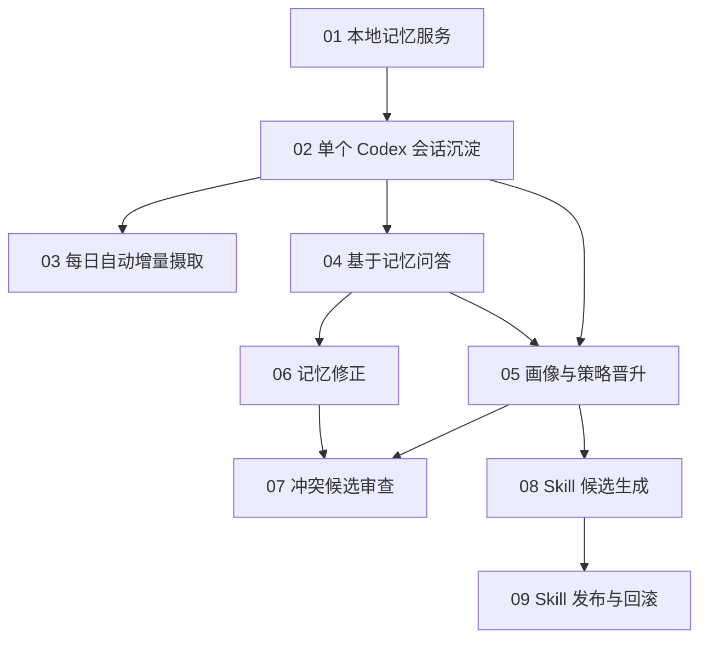

# Aquarius：长期记忆 Agent 垂直切片

本目录把已批准的长期记忆 Agent 方案拆成 tracer-bullet tickets。每个 ticket 都交付一条可独立演示或验证的端到端能力，而不是只完成数据库、API 或 Agent Prompt 等单独技术层。

完整实现方案见 [PLAN.md](PLAN.md)。

## 已锁定的产品决策

- 单用户、本地后台服务，CLI 与 localhost API 为首版入口。
- OpenAI Agents SDK for TypeScript（`@openai/agents`）负责有界 Agent runtime；普通 TypeScript 负责门禁、调度、校验、存储和执行。
- Git 是长期语义记忆的 canonical source；SQLite 保存运行状态和可重建 FTS 索引。
- 首版只接入 Codex sessions，其他 Agent 通过 adapter 契约扩展。
- 记忆分为经历、用户画像、策略和 Skill。
- 经历可由一次有效证据写入；推断画像/策略需两个独立 case；Skill 候选需三个独立成功 case。
- Skill 可以自动生成候选，但发布必须由用户批准；发布只做静态校验，不做质量评测。
- 每天 Asia/Shanghai 03:00 自动摄取，错过后在服务启动时补跑。

## Ticket 依赖图

## 执行 Frontier

1. 首先执行 01。
2. 01 完成后执行 02。
3. 02 完成后，03 和 04 可以并行；05 已具备部分前置条件，但仍需等待 04。
4. 04 完成后，05 和 06 可以并行。
5. 05、06 完成后可执行 07；05 完成后也可并行执行 08。
6. 08 完成后执行 09。

## Ticket 索引

- [01：启动可用的本地记忆服务](issues/01-local-memory-service.md)
- [02：将单个 Codex 会话沉淀为经历](issues/02-ingest-one-codex-session.md)
- [03：每日自动增量摄取并补跑](issues/03-daily-incremental-ingestion.md)
- [04：用当前记忆回答并给出引用](issues/04-query-current-memory.md)
- [05：跨案例自动沉淀画像与策略](issues/05-promote-profile-and-strategy.md)
- [06：预览确认并提交记忆修正](issues/06-correct-memory.md)
- [07：审查并解决冲突候选](issues/07-review-conflicting-candidates.md)
- [08：从重复策略生成 Skill 候选](issues/08-generate-skill-candidate.md)
- [09：批准、安装和回滚 Skill](issues/09-publish-and-rollback-skill.md)
